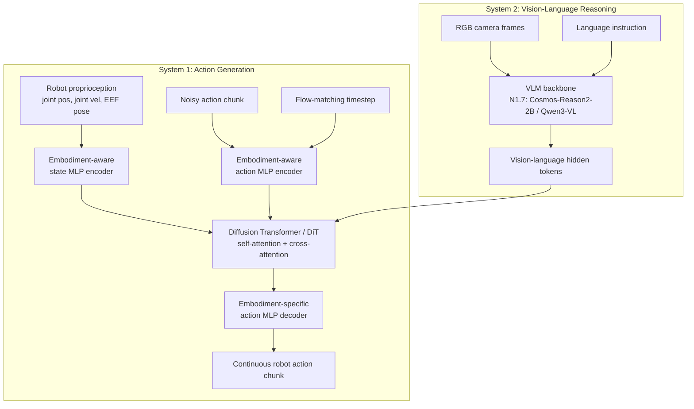

# NVIDIA Isaac GR00T N1.7

## Metadata

- Source: https://github.com/NVIDIA/Isaac-GR00T/blob/main/README.md
- Local document: [../papers/NVIDIA-Isaac-GR00T-N1.7.md](../papers/NVIDIA-Isaac-GR00T-N1.7.md)
- Type: GitHub README / model release documentation
- Related paper: GR00T N1: An Open Foundation Model for Generalist Humanoid Robots, arXiv:2503.14734
- Status: Early Access release

## Research Question

The document presents GR00T N1.7 as a practical open VLA stack for generalized humanoid robot skills. The main question is how to adapt a large pretrained vision-language-action model to different robot embodiments, datasets, and deployment targets.

## Core Method

GR00T N1.7 combines a vision-language foundation model with a diffusion transformer action head that denoises continuous robot actions. The model takes multimodal inputs such as language, images, state, and embodiment-specific configuration, then predicts action chunks. It supports base-model inference, finetuned checkpoints, custom-robot finetuning, open-loop evaluation, closed-loop deployment through a ZMQ policy server, and optional TensorRT acceleration.

## Key Innovations

- New VLM backbone: Cosmos-Reason2-2B / Qwen3-VL replaces the N1.6 Eagle backbone.
- Relative end-effector action space: actions are represented as deltas from the current pose, improving cross-embodiment transfer.
- Human video pretraining: N1.7 uses 20K hours of EgoScale human video data together with robot demonstrations.
- Commercially usable stack: code is Apache 2.0 and model weights use the NVIDIA Open Model License.
- Practical deployment path: supports Hugging Face checkpoints, LeRobot-style datasets, PolicyServer inference, ONNX, and TensorRT export.

## Problems Solved

GR00T N1.7 addresses the gap between foundation VLA models and deployable robot policies. It gives a concrete path for taking demonstrations from a robot, converting them into a known dataset format, finetuning the model with an embodiment tag and modality config, then evaluating and deploying it through a policy API.

It also targets cross-embodiment generalization. Relative EEF actions make robot and human motion data more compatible, which should help transfer manipulation priors from human video into robot control.

## Evidence

The README does not provide full benchmark tables. It states that N1.7 delivers comparable performance to N1.6 with improved generalization and language following, and lists finetuned checkpoints for LIBERO, DROID, SimplerEnv Bridge, and SimplerEnv Fractal. It also documents a custom embodiment workflow using `NEW_EMBODIMENT` and an SO100 example dataset.

## Limitations

This is an Early Access release, so support and stability guarantees are limited until GA. Inference requires at least a 16 GB GPU, and finetuning recommends 40 GB or more VRAM. The README is implementation documentation rather than a peer-reviewed N1.7 paper, so detailed ablations, benchmark numbers, and failure analysis are not included here.

## Application to My Robot

GR00T N1.7 is useful if my robot needs language-conditioned manipulation and I can collect demonstrations. The practical path is:

- convert robot demonstrations into GR00T LeRobot v2 format with `meta/modality.json`;
- define state, action, and camera keys through a modality config;
- start with `NEW_EMBODIMENT` finetuning from `nvidia/GR00T-N1.7-3B`;
- evaluate open-loop action prediction before any closed-loop hardware test;
- deploy with PolicyServer and connect its action output to my robot controller.

For a humanoid or whole-body robot, the `UNITREE_G1_SONIC` path is especially relevant because it combines the VLA with a learned whole-body controller that decodes compact latent actions into coordinated joint commands.

## Implementation Notes

Do not begin with full production deployment. First validate data conversion and action conventions on a small dataset, then run open-loop evaluation against recorded actions. The most important engineering decision is the action representation: if possible, use relative EEF deltas and make sure gripper, wrist, base, and camera conventions are stable across training and deployment.

## Question Analysis

### What is the model architecture of GR00T N1.7?

GR00T N1.7 is a dual-system VLA model. System 2 is the vision-language reasoning module, and N1.7 upgrades this backbone to Cosmos-Reason2-2B / Qwen3-VL. It processes RGB images and language instructions into vision-language hidden tokens. System 1 is the action generation module, implemented as a Diffusion Transformer / flow-matching action transformer. It conditions on System 2 tokens, robot proprioception, noised action chunks, and the diffusion timestep, then predicts continuous action chunks for the target robot.

The important point is that the VLM does not directly output motor commands. It outputs learned hidden representations that carry scene, task, and subtask information. The action transformer uses these representations through cross-attention while generating robot-specific continuous actions.

### How to understand embodiment-aware MLP encoders and decoders?

Different robots expose different state and action dimensions: a single-arm robot, bimanual manipulator, humanoid upper body, or dexterous hand all have different proprioception and control vectors. GR00T uses embodiment-aware MLPs as adapters between each robot's physical interface and the shared action transformer space.

On the input side, a state encoder MLP maps robot-specific proprioception, such as joint positions, velocities, and EEF poses, into a shared state embedding. An action encoder MLP maps the noised action chunk and flow-matching timestep into action token embeddings. On the output side, an embodiment-specific action decoder MLP maps final DiT tokens back into the action vector required by that robot.

This means the shared System 1 DiT can learn reusable action-generation structure, while the MLP adapters absorb differences in robot morphology, action dimension, and control convention.

### What is the relation between embodiment-aware MLPs and System 1?

The embodiment-aware MLPs are part of the System 1 action path, not a separate third system. System 1 consists of the DiT plus the state/action encoders and action decoder that allow the DiT to handle multiple embodiments.

```text
robot state
  -> embodiment-aware state MLP encoder
  -> state embedding
  -> System 1 DiT

noisy action chunk + timestep
  -> embodiment-aware action MLP encoder
  -> action embedding
  -> System 1 DiT

System 1 DiT output
  -> embodiment-specific action MLP decoder
  -> robot-specific continuous action chunk
```

Without these adapters, the DiT would need to directly handle incompatible state/action vector sizes across embodiments. With them, the DiT operates in a common latent space and the adapters translate between that space and each robot.

### What are System 2 high-level action tokens?

The "high-level action tokens" are best understood as continuous VLM hidden tokens, not manually defined symbolic skills such as `reach`, `grasp`, or `place`. Images and language are tokenized and fused by the VLM, and GR00T extracts intermediate hidden representations from that VLM. These tokens implicitly encode task goal, relevant objects, spatial relationships, and likely subtask phase.

During training, System 1 learns to use these tokens to predict the correct action chunk. Therefore their action meaning is learned end-to-end from robot trajectories, not hand-authored as a discrete action vocabulary.

These tokens should also be distinguished from latent actions used in training on action-less human or generated videos. VLM hidden tokens condition the policy; latent actions are pseudo-action labels or learned action targets used to make video-only data useful for flow-matching training.

### Algorithm module diagram


