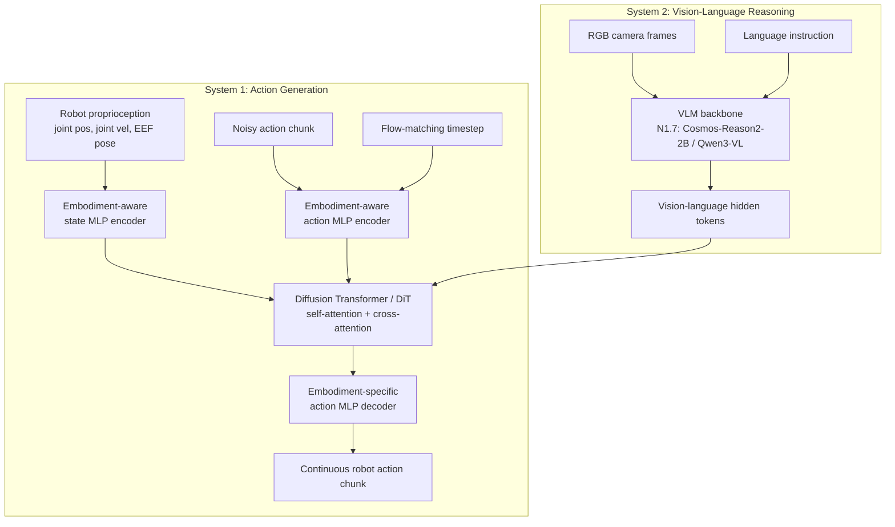

# NVIDIA Isaac GR00T N1.7

## 元数据

- 来源：https://github.com/NVIDIA/Isaac-GR00T/blob/main/README.md
- 本地文档：[../papers/NVIDIA-Isaac-GR00T-N1.7.md](../papers/NVIDIA-Isaac-GR00T-N1.7.md)
- 类型：GitHub README / 模型发布文档
- 相关论文：GR00T N1: An Open Foundation Model for Generalist Humanoid Robots，arXiv:2503.14734
- 状态：Early Access 发布

## 研究问题

这份文档展示的是 GR00T N1.7 作为开放 VLA 机器人模型栈的使用方式。核心问题不是单个算法公式，而是：如何把一个预训练的 vision-language-action 模型适配到不同机器人本体、不同数据集和真实部署流程中。

## 核心方法

GR00T N1.7 把视觉语言基础模型和 diffusion transformer 动作头结合起来。模型输入语言、图像、机器人状态和本体配置，输出连续动作块。它支持基础模型推理、微调 checkpoint、自定义机器人微调、open-loop 评估、基于 ZMQ 的 PolicyServer 闭环部署，以及 ONNX / TensorRT 加速。

## 关键创新

- 新 VLM 骨干：用 Cosmos-Reason2-2B / Qwen3-VL 替代 N1.6 的 Eagle backbone。
- 相对末端执行器动作空间：把动作表示为相对当前位姿的 delta，而不是绝对目标位姿，有利于跨本体泛化。
- 人类视频预训练：N1.7 使用 20K 小时 EgoScale 人类视频数据，并结合多样化机器人示教。
- 商业可用：代码采用 Apache 2.0，模型权重使用 NVIDIA Open Model License。
- 工程闭环完整：支持 Hugging Face checkpoint、LeRobot 风格数据集、PolicyServer 推理、ONNX 和 TensorRT 导出。

## 实际解决的问题

GR00T N1.7 解决的是“基础 VLA 模型如何落到真实机器人策略”的问题。它给出了从机器人示教数据、数据格式转换、本体标签、modality 配置、微调、评估到部署的完整路径。

它也针对跨机器人本体泛化做了改进。relative EEF action 让机器人数据和人类操作视频更容易对齐，因此模型可以把人类视频中的操作先验迁移到机器人控制中。

## 实验证据

README 没有给出完整 benchmark 表格。它声明 N1.7 相比 N1.6 保持相近性能，同时提升泛化和语言跟随能力；并提供了 LIBERO、DROID、SimplerEnv Bridge、SimplerEnv Fractal 的微调 checkpoint。文档还提供了 `NEW_EMBODIMENT` 自定义本体微调流程，以及 SO100 示例数据集。

## 局限性

这是 Early Access 版本，稳定性和支持承诺有限。推理至少需要 16 GB 显存，微调建议 40 GB 以上显存。该 README 是工程使用文档，不是 N1.7 的完整论文，因此缺少详细消融实验、完整 benchmark 数字和失败案例分析。

## 应用到我的机器人

如果我的机器人需要语言条件下的操作能力，并且可以采集示教数据，GR00T N1.7 很值得作为基线。实际路线是：

- 把机器人示教转换成 GR00T LeRobot v2 格式，并提供 `meta/modality.json`；
- 用 modality config 明确定义 state、action 和 camera key；
- 从 `nvidia/GR00T-N1.7-3B` 开始，用 `NEW_EMBODIMENT` 做微调；
- 先用 open-loop evaluation 对比预测动作和真实动作；
- 再通过 PolicyServer 接入机器人控制器做闭环测试。

如果我的机器人是类人或全身控制平台，`UNITREE_G1_SONIC` 路线尤其值得关注。它把 VLA 输出的紧凑 latent action 交给 learned whole-body controller，解码成腿、臂、手的协调关节命令。

## 实施建议

不要一开始就做生产部署。先用小数据集验证数据转换、动作维度、相机命名和归一化是否正确，再做 open-loop 评估。最关键的工程决策是动作表示：优先使用 relative EEF delta，并保证夹爪、腕部、底盘和相机坐标约定在训练和部署时完全一致。

## 问题分析

### GR00T N1.7 的模型架构是怎样的？

GR00T N1.7 是一个双系统 VLA 模型。System 2 是视觉语言推理模块，N1.7 把该模块升级为 Cosmos-Reason2-2B / Qwen3-VL 骨干，用 RGB 图像和语言指令生成 vision-language hidden tokens。System 1 是动作生成模块，使用 Diffusion Transformer / flow-matching action transformer。它以 System 2 的 tokens、机器人本体状态、加噪 action chunk 和 diffusion timestep 为条件，预测目标机器人的连续动作块。

关键点是：VLM 不直接输出电机控制命令。它输出的是带有场景、任务和子任务信息的隐藏表示；真正生成连续动作的是 System 1 的动作 transformer。

### embodiment-aware MLP 编码/解码怎么理解？

不同机器人有不同的 state 和 action 维度：单臂机械臂、双臂操作臂、人形上半身、灵巧手的关节数、末端执行器表示和控制量都不一样。GR00T 用 embodiment-aware MLP 作为“机器人身体接口适配器”，把每个机器人自己的物理接口接到共享的动作 transformer 表示空间。

输入侧，state encoder MLP 把某个机器人的 proprioception，例如关节位置、关节速度、末端执行器位姿，映射成统一维度的 state embedding。action encoder MLP 把加噪 action chunk 和 flow-matching timestep 映射成 action token embedding。输出侧，embodiment-specific action decoder MLP 把 DiT 最后的 token 映射回该机器人实际需要的 action vector。

因此，共享的 System 1 DiT 学的是可复用的动作生成结构；不同机器人的自由度、动作维度和控制约定由小型 MLP adapter 吸收。

### embodiment-aware MLP 和 System 1 是什么关系？

embodiment-aware MLP 属于 System 1 的动作路径，不是独立的第三个系统。System 1 可以理解为 DiT 主体加上 state/action encoder 和 action decoder。MLP adapter 让 DiT 能够处理多种机器人本体。

```text
robot state
  -> embodiment-aware state MLP encoder
  -> state embedding
  -> System 1 DiT

noisy action chunk + timestep
  -> embodiment-aware action MLP encoder
  -> action embedding
  -> System 1 DiT

System 1 DiT output
  -> embodiment-specific action MLP decoder
  -> robot-specific continuous action chunk
```

如果没有这些 adapter，DiT 就要直接面对不同机器人之间不兼容的 state/action 维度。有了 adapter，DiT 在统一 latent space 中工作，adapter 负责在统一表示和具体机器人控制量之间翻译。

### System 2 VLM 输出的 high-level action tokens 是怎样定义的？

这里的 high-level action tokens 更准确地说是 VLM 产生的连续 hidden tokens，而不是人工定义的离散技能标签，比如 `reach`、`grasp`、`place`。图像和语言先经过 VLM token 化和融合，GR00T 再取 VLM 的中间层隐藏表示。这些 tokens 会隐式编码任务目标、相关物体、空间关系和可能的子任务阶段。

训练时，System 1 必须利用这些 tokens 预测正确 action chunk。因此这些 tokens 的动作语义来自端到端训练，而不是手写的 action vocabulary。

还要区分它们和论文中用于无动作视频训练的 latent actions：VLM hidden tokens 是策略的条件输入；latent actions 是从人类视频或生成视频中提取的伪动作标签或学习目标，用来让没有真实机器人动作的数据也能参与 flow-matching 训练。

### 算法模块图


